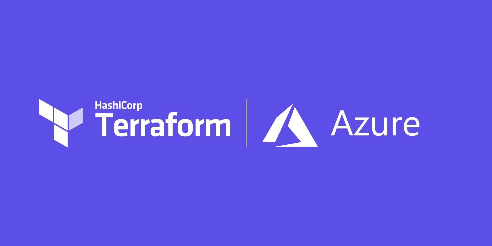
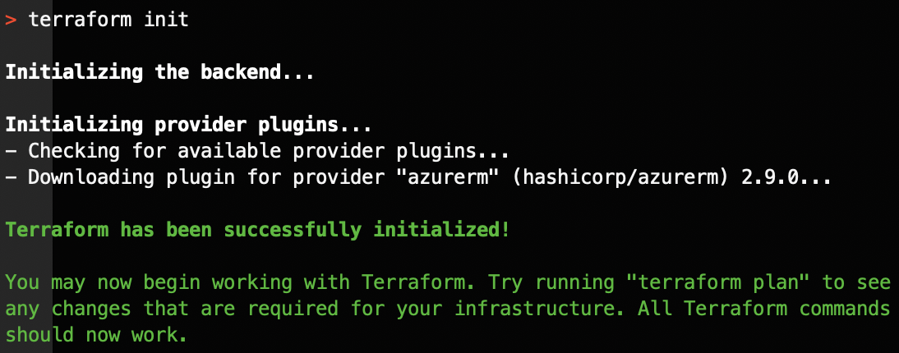
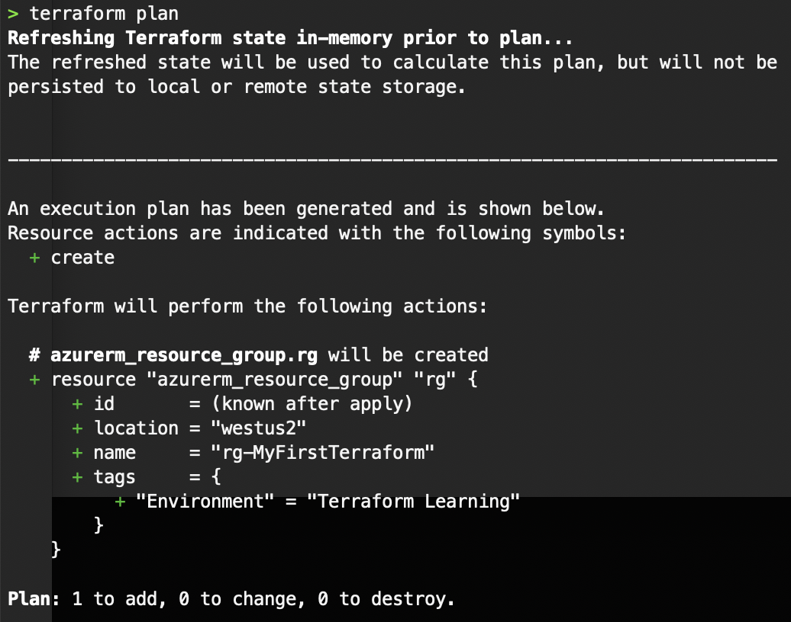
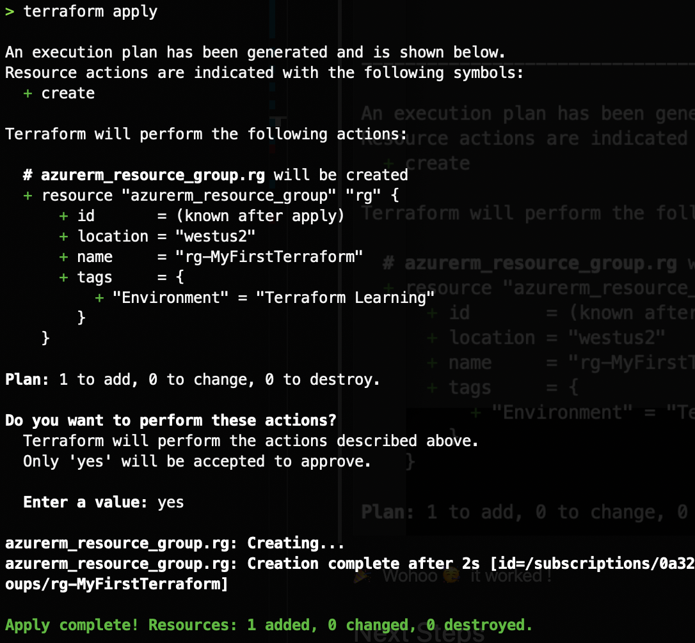
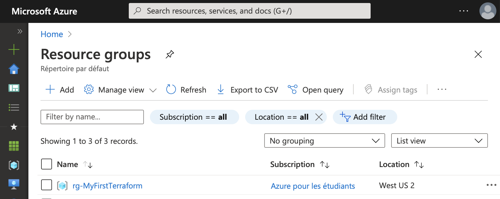

# Ready Steady Go!

## Introduction

I learn best by doing, so I am going to setup the tools needed to do Terraform labs on my local machine.

Since I am going to be mainly using Azure and I want to be able to execute commands interactively I will have to figure out how the authentication is done too.

## Prerequisite

- You need to have some priore knowledge of the cloud provider you will use, in my case Azure.
- You will also need an Azure account with an active subscription to be able to execute the labs

## Install the tools and environment

- Install Terraform
- VS Code : Install Terraform Extension

## Authenticating using Azure CLI

- I will be [authenticating using Azure CLI](https://www.terraform.io/docs/providers/azurerm/guides/azure_cli.html) since I am going to use Terraform in an interactive mode
- The recommendation is to [use Managed Service Identity](https://www.terraform.io/docs/providers/azurerm/guides/managed_service_identity.html) when running Terraform non-interactively (from CI server for instance)

```bash
# 1. Install Azure CLI
brew update && brew install azure-cli

# 2. Login
az login

# 3. List subscriptions associated with the account
az account lis -o table

# 4. If you have more than one subscription specify one
az account set --subscription="SUBSCRIPTION_ID"
```

To test that everything is well configured, let's create a Resource Group

Copy this into a file named `main.tf` inside a folder `MyFirstTerraform`

```json
provider "azurerm" {
  features{}
  version = "2.9.0"
}

#create resource group
resource "azurerm_resource_group" "rg" {
    name     = "rg-MyFirstTerraform"
    location = "westus2"
    tags      = {
      Environment = "Terraform Learning"
    }
}
```

Then execute these commands:

`terraform init`



`terraform plan`




`terraform apply`



## 🎉 Wohoo 🥳 it worked !

Now connect to the Azure Portal, you will see that the resource group was created



## Next Steps

The next time I will go through the details of what happened here and write some infrastructure

## Social Proof

[Twitter](https://twitter.com/BleuMostafa/status/1290620164640313350)
