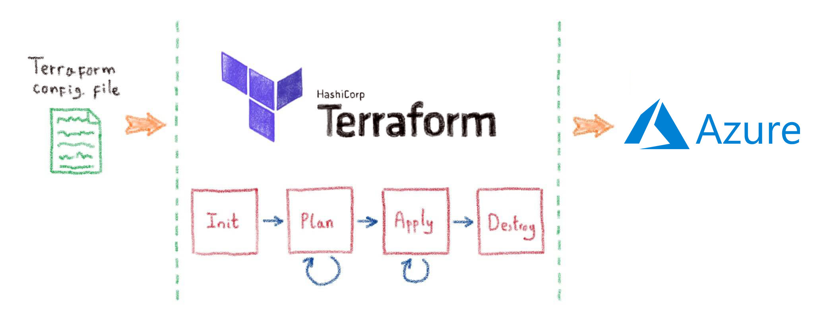

# Terraform's Simple stages & commands 👌

### Materials

- [Building Azure Infrastructure with Terraform](https://www.youtube.com/watch?v=d6EOEXxMZ8w)  [0 - 11m]— Youtube/CloudSkills
- [Get Started - Azure](https://learn.hashicorp.com/terraform/azure/configure_az)  —  Learn Terraform
- [What Terraform is, its use cases, how it works and how it's different from Ansible](https://www.youtube.com/watch?v=l5k1ai_GBDE) — Youtube/TechWorld with Nana

### Notes

- Terraform uses a declarative model for defining infrastructure
You write the desired state and leave it up to Terraform and Azure Provider to determine how to create and configure Azure
- Terraform configuration is idempotent
If you apply the same configuration a second time Terraform will not reapply the settings
- Terraform configuration supports 2 formats :  
`.tf` HashiCorp Configuration Language (HCL) → DevOps friendly & Advanced 
`.tf.json` JSON → machine-friendly
- `terraform.tfstate` State file keeps track of all managed resources and their associated properties with current values → ⚠️Extremely Important

**Commands**

`terraform init` 
*Initialize the Terraform configuration directory*

- Creates a hidden directory (.terraform) and downloads plugins as needed by the configuration
- Init also configures the backend for Terraform state
- Terraform uses a plugin-based architecture to support various providers, each provider is its own binary distributed separately from Terraform itself (same concept as Nuget, NPM, PowerShell modules)
- You can use multiple providers in the same configuration

`terraform plan`  
*Create an execution plan*

- Before you can create infrastructure Terraform needs to generate an execution plan
- The execution plan specifies what actions and the order Terraform will take to achieve the desired state defined in the configuration
- The output is similar to diff format generated by git
- Also checks the syntax of the configuration and attempts to connect to Azure to refresh the state prior to checking for differences with the current configuration.
- **Changing Resources :** 
Some changes will force Terraform to destroy and then recreate the resource
Example : changing the nam or location of a resource will recreate the resource
However, adding tags to a resource group will be an incremental change

`terraform apply`  
*Create or modify infrastructure*

- If you don't specify a plan Terraform will recalculate the plan
In practice you would specify to export the plan by `terraform plan -out FILE` 
Review it and use the same plan for apply
- When the resource is created it also writes data into the `terraform.tfstate` file

`terraform show` 
*Inspect the current state*

- Terraform state is essential for managing changes to infrastructure over time
- It's necessary to preserve the state file for the entire life cycle of the resources
- Recommendation is to use a remote backend to save state in centralised, secure storage

`terraform destroy` 
*Destroy the resources*

- Terraform determines the order in which things must be destroyed
- Be careful

`terraform refresh` 
*Query provider to get current state*

## Social Proof

[Twitter](https://twitter.com/BleuMostafa/status/1290989357759954946?s=20)
