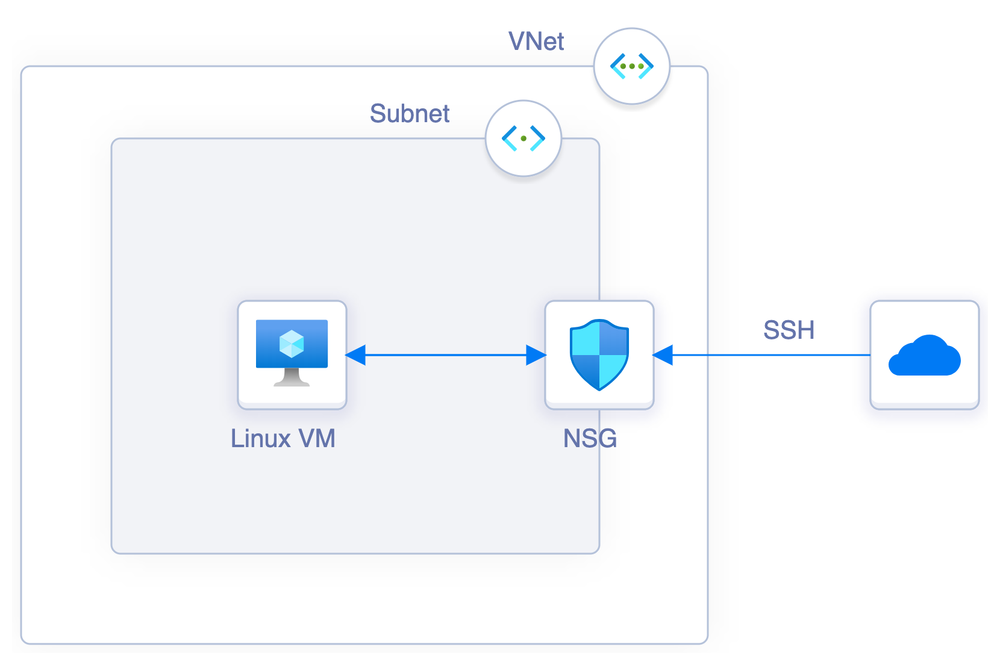
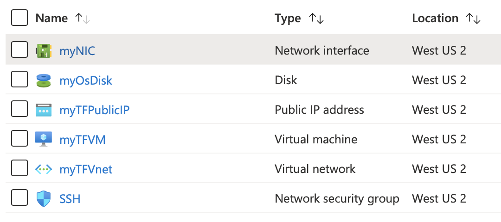

# Dependencies & Provisioners

## Resource Dependencies

The order of blocks is not important, as the order of the plan is inferred from blocks dependencies

**Implicit dependencies**

- Determined automatically by the Azure provider based on configuration
- Inferred from using the expression for example

**Explicit dependencies**

- `depends_on` meta-argument to explicitly define a dependency
- Used when Terraform can't see an implicit dependency or want to override the default execution plan

### Lab: Build a Linux Virtual machine with Public Ip and apply an NSG to enable SSH access

See [Lab1/main.tf](Lab1/main.tf)

## Provisioners

- Help do additional setup and configuration when a resource is created or destroyed
- Similar to Virtual Machine Extensions in Azure and Cloud Init, User Date in AWS
- Are not intended to maintain desired state and configuration of existing resources → Use a configuration management tool instead (Chef, Ansible or PowerShell)
- Use Provisioners as a last resort

### Lab: Build a Linux Virtual machine and copy a local file to it using `file` provisioner

See [Lab2/main.tf](Lab2/main.tf)

## Social Proof

[Twitter](https://twitter.com/BleuMostafa/status/1291750155688042497?s=20)
